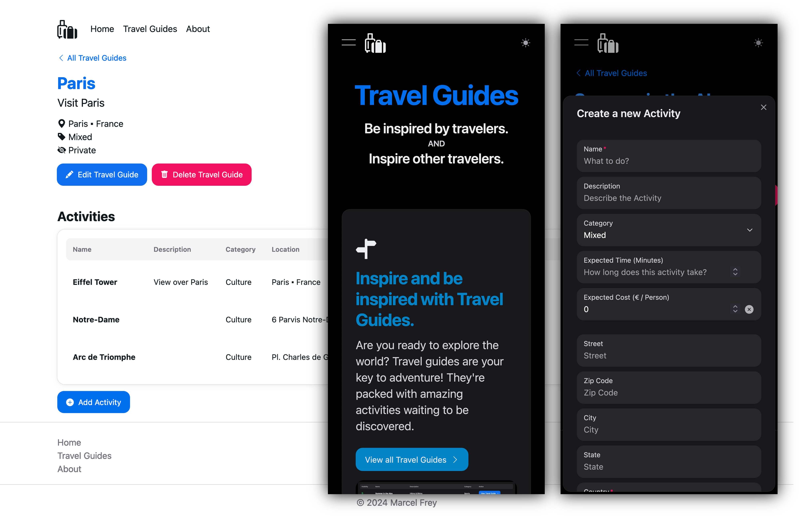

# IU-DOCC-Project-Cloud-Computing

[](https://github.com/marcelfrey29/IU-DOCC-Project-Cloud-Computing/actions/workflows/ci-node.yml)
[](https://github.com/marcelfrey29/IU-DOCC-Project-Cloud-Computing/actions/workflows/ci-go.yml)
[](https://github.com/marcelfrey29/IU-DOCC-Project-Cloud-Computing/actions/workflows/cfn-lint.yml)
[](https://github.com/marcelfrey29/IU-DOCC-Project-Cloud-Computing/workflows/sast.yml)

## Travel Guides



- [x] Single Page Web Application (**React, NextUI, TypeScript**)
- [x] Backend with logic and NoSQL Database (**Golang, Fiber, Zap**)
- [x] Local Version (**Docker, Docker-Compose, Nginx, DynamoDB-Local**)
- [x] Cloud Version - Refactoring to Serverless (**AWS Lambda, API Gateway, DynamoDB, S3, CloudFront, CloudWatch**)
- [x] Cloud Deployment to AWS via Infrastructure as Code (**CloudFormation**)
- [x] Security Scanning for OWASP Top 10 Issues (**Bearer**)
- [x] HTTP Collection to be used for Integration Testing (**Bruno**)
- [x] Quality Checks via CI (**GitHub Actions, CFN Lint**)

## Documentation

- [Project Idea](docs/01-Idea.md)
- [Requirements](docs/02-Requirements.md)
- [Local Application](docs/03-Local-Application.md)
- [Cloud Migration Planning](docs/04-Plan-Cloud-Migration.md)
- [Cloud Migration & Deployment](docs/05-Cloud-Migration.md)

## Requirements

- Node.js LTS >= 20.0.0
- Golang >= 1.23.0
- Docker (incl. Docker Compose)
- AWS CLI must be installed and configured
    - For local execution (e.g. DynamoDB Local) Dummy-Access-Keys can be used
    ```conf
    # ~/.aws/credentials
    [default]
    aws_access_key_id = XXXXX
    aws_secret_access_key = XXXXX
    ```
- [Bearer CLI](https://github.com/Bearer/bearer) (Optional) must be installed for Security Scanning (SAST)
    - Run SAST with `bearer scan .` in project root
- [Bruno](https://www.usebruno.com/) (Optional) as HTTP Client
    - Collection with Assertions is located in `tools/bruno`
- AWS Account (To deploy the Cloud Version of the Application)
    - The AWS CLI must be configured with real credentials
- [AWS CloudFormation Linter](https://github.com/aws-cloudformation/cfn-lint) (Optional)

## Running the Project 

### Run Locally

> [!CAUTION]
> To run the local version you must switch to [Version 1.0.0 (Local Implementation)](https://github.com/marcelfrey29/IU-DOCC-Project-Cloud-Computing/tree/v1.0.0).
>
> The `main` branch (and [Version 2.0.0 (Cloud Migration)](https://github.com/marcelfrey29/IU-DOCC-Project-Cloud-Computing/tree/v2.0.0)) contain the source code of the cloud migration. 
> Local execution is currently not possible because the backend code is designed to run in AWS Lambda only.

All services can be managed at once via Docker Compose.

> [!TIP]
> Quick-Start: Run `docker compose up --build -d`

```bash
# Run latest version of all services
docker compose up --build
docker compose up --build -d

# Run all services
docker compose up
docker compose up -d

# Remove all services
docker compose down

# Stop & Start
docker compose stop
docker compose start

# Get logs when running in detached mode
# docker logs <container_name>
docker logs iu-project-cc-backend
```

#### Initial Setup of DynamoDB Local

When the DynamoDB Local Container started for the first time, we need to create a Table manually (just like we have to when using real AWS infrastructure).
To perform this task, the `tools/create-local-table.sh` script can be used. 

> [!IMPORTANT]
> DynamoDB Local must be running.

```bash
# Create Table
./tools/create-local-table.sh

# Verify Table Creation
aws dynamodb list-tables --endpoint-url http://localhost:8000
```

Expected Output: 
```json
{
    "TableNames": [
        "TravelGuides"
    ]
}
```

### Running on AWS

> [!CAUTION]
> Not all services are part of the AWS Free Tier, so costs can occur. Deploy at your own risk. 

#### Infrastructure Deployment

```bash
# First-Time Stack Creation (One-Time!)
./create-stack.sh

# Stack Updates
./update-stack.sh

# Stack Details
aws cloudformation describe-stacks --stack-name TravelGuides

# Access Outputs
aws cloudformation describe-stacks --stack-name TravelGuides --query 'Stacks[0].Outputs[?OutputKey==`WebAppBucketName`].OutputValue' --output text

# Run Linter
cfn-lint cloudformation/template.yaml
```

#### Application Deployment

```bash
# Update Everything
./update.sh

# Deploy Web App
./deploy-web-app.sh

# Upload Lambda Code to S3 and deploy it
./deploy-backend.sh
```

#### Delete AWS Resources

```bash
# Delete 
./delete-stack.sh
```
