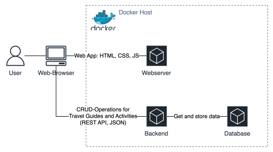
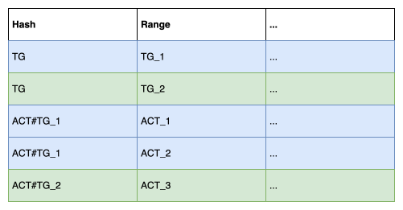
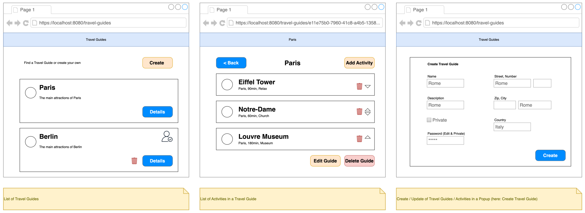

# Development of the Local Version of the Application

## Requirements

To develop the inital, local version of the web app, requirements have been defined as User Stories as described in the [Requirements Documentation](02-Requirements.md).

Tasks:

- #15
- #1
- #2
- #3
- #4
- #5

User Stories:

- #6
- #7
- #11
- #10
- #9
- #8
- #12
- #13
- #14
- #16

## Architecture

The Web Application is a Single Page Application (SPA). 
[React](https://react.dev/) and the [NextUI](https://nextui.org/) Framework are used to build the SPA.
The static `.html`, `.css` and `.js` files of the SPA are hosted on a web server.
For the local application, [nginx](https://nginx.org/en/) is used as web server. 

The backend service provides a REST API which allows Create, Read, Update and Delete (CRUD) operations on resources.
All API endpoints will be handled by a single service.
[Golang](https://go.dev/) and the [Fiber](https://gofiber.io/) Web Framework are used to build the backend service.

Application data like Travel Guides and Activities are stored in a database. 
The [DynamoDB Local](https://docs.aws.amazon.com/amazondynamodb/latest/developerguide/DynamoDBLocal.html) NoSQL database is used. 

HTTP Request are performed by the SPA from the browser to the backend service. 
Request and response data transfered in JSON format. 
The backend service reads and writes data to the database.

The web application, backend, and database are running in seperate Docker Containers.
[Docker Compose](https://docs.docker.com/compose/) is used to launch the entire application stack with a single command.
Persistent storage is only needed for the database container.
Locally, all applications are running on the same Docker Host.
There is no redundancy or load balancing.

## NoSQL Design (DynamoDB)

NoSQL Databases are very scalable and extremely fast in querying when the partition and range keys are used. 
However, this limits how data can be queried.
Therefore, we must understand which data needs to be queried.

Looking at our requirements, we can identify a few access patterns:

1. Get all Travel Guides
    - [Issue #8](https://github.com/marcelfrey29/IU-DOCC-Project-Cloud-Computing/issues/8)
1. Get all Activities of a Travel Guide
    - [Issue #7](https://github.com/marcelfrey29/IU-DOCC-Project-Cloud-Computing/issues/7)
1. Get a single Travel Guide
    - [Issue #7](https://github.com/marcelfrey29/IU-DOCC-Project-Cloud-Computing/issues/7)

With this query requirements in mind, we can design the data model (Table).

1. Get all Travel Guides
    - Query with `Hash="TG"`
1. Get all Activities of a Travel Guide
    - Query with `Hash="ACT#<TG_<tg-id>"` (Travel Guide ID with `ACT#` Prefix)
1. Get a single Travel Guide
    - Get with `Hash="TG"` and `Range="TG_<tg-id>"` (ID of Travel Guide)

> [!CAUTION]
> **The way Travel Guides are stored increases the risk of a Hot Partition** because the Hash-Key is always `TG` which means there is no distribution across partitions.
>
> However, there will me way more Activities than Travel Guides because each Travel Guide consits of multiple Activities. 
> Activities are well distributed across partitions so there is no risk of hot partitions. 
>
> Without `TG` as Hash Key, we would need to use the `Scan` operation which is really expensive and should be avoided.
>
> I decided to go with this solution because the risk of a hot partition is way lower than the risk of the cost- and performance impact when using `Scan`. 

## UI Design

Simple mockups for the User Interface.

## Implementation

- Basic setup of the frontend- and backend projects so that we have running _hello world_-versions
- Docker and Cocker Compose setup, including the DynamoDB Database so that the applications can run in containers
    - Docker Builder-Pattern is used
    - Backend: Debian Linux where the built binary is started
    - Frontend: nginx webserver which serves the static website
    - Database: DynamoDB from Docker Hub
- Setup of additional tooling
    - GitHub Actions CI/CD to build and test the `main`-branch as well as Pull Requests against `main`
    - GitHub Dependabot for automatic dependency updates (Pull Request for new versions of npm packges, go modules, docker images, and GitHub Action actions)
- Setup of Security Tooling (SAST) to prevent typical Security Issues (e.g. OWASP Top 10) 
    - Applying latest Cyber Security Learnings
- DynamoDB Design
- UI Design
- Implementation ([Milestone: Local Implementation](https://github.com/marcelfrey29/IU-DOCC-Project-Cloud-Computing/milestone/1))
    - Ticket-based
    - API-first
        - Bruno HTTP Collection for Testing (can be found in `/tools/bruno`)
        - Run all Requests as _Integration Test_ (Not yet part of CI, see [Issue #68](https://github.com/marcelfrey29/IU-DOCC-Project-Cloud-Computing/issues/68))
    - Add Frontend for APIs (inspired by Mockups)
    - Git Feature-Branches (short-living)
- Refactorings
    - Example: Extract Modal to Create a Travel Guide into own component and add `create` and `update` mode
        - Before: Embedded in List Page
        - Create/Update is mostly the same (except a few label names, prefill on update, and the method to be called)
        - Control via Property
