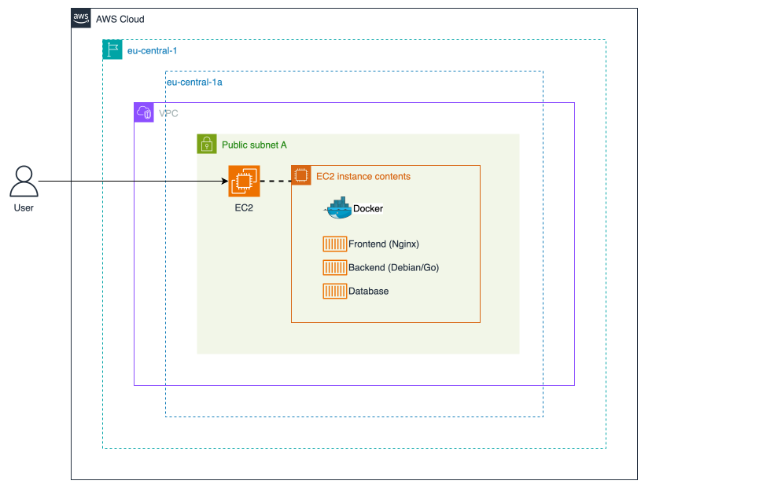
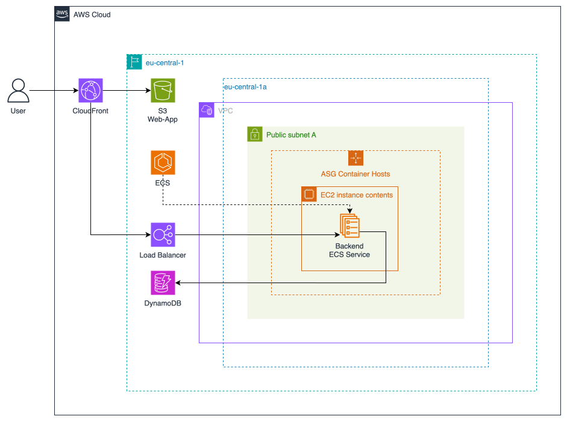
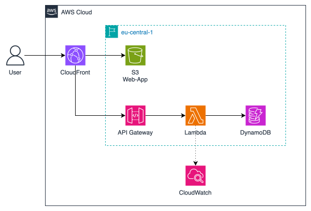

# Plan Cloud Migration

Migrate the local version of the application to the AWS Cloud.

## Process

- Select evaluation criteria
- Identify different migration strategies
    - Cloud Service Model
    - Architecure Diagram
    - AWS Services
    - Evaluate Costs with AWS Pricing calculator
- Compare different migration strategies based on the criteria (Evaluation)
- Select migration strategy: Refactor to Serverless
- Create detailed architecture diagram and tickets

## Criteria

- Sclalability and Fit-to-Workload
- Availability
- Security
    - In Transit
    - At Rest
- Cost (Infrastructure)
- Operational Model
    - Capacity Planning
    - Maintenance / Patching
- Risk of Lock-In

> [!WARNING] 
> For Scalability and Fit-to-Workload we have to assume a usage scenario. 
>
> We assume that our application is heaviliy used before and after the vacation-season. 
> This means we expect four spikes over the year (Before Summer, After Summer, Before Winter, After Winter).
>
> Before users go to vaction, they get inspiration on what to do at their location. 
> While the load is higher in general, we will have many read-operations.
>
> Once people come back, they might create their own travel guide to inspire other travelers. 
> While the load is higher in general, we will have more write-operations. 

>[!WARNING]
> To make a fair price comparison, we must compare the solutions with the same level of availability and scalability.
> 
> For example, AWS Lambda is hightly available by default because it uses all Availability Zones (Re-architecture). 
> While a single server would be enough for the Rehost and Replatform solution, we will calculate the price with 3 instances and a load balancer to have the same level of availability.

>[!WARNING]
> General Assumptions
> 
> - 500GB Traffic / Month (10% Write: 50GB)
> - App will be used in Europe and USA (50:50)

>[!NOTE]
> Some general criteria apply to all migration strategies
> - Deployment Model (Public Cloud)
> - Utility Pricing / No upfront costs
> - Internet Connectivity / Outages
> - Data Deletion

## References 

- [AWS 6Rs](https://aws.amazon.com/blogs/enterprise-strategy/6-strategies-for-migrating-applications-to-the-cloud/)
    - **Rehosting**: Lift-and-shift
        - Move existing workloads as they are
        - No cloud optimization
    - **Replatforming**: Lift-thinker-and-shift
        - Core Architecture stays unchanged
        - A few cloud optimizations are performed
    - **Refactoring/Re-architecting**
        - Use cloud-native features

## Possible Migration Strategies

**Retire**, **Retain**, and **Repurchasing** are not allowed for this project. 😅

### Rehosting

- IaaS
- Use a single EC2 Virtual Machine, install Docker, and run the Compose Stack
    - _We continue with our own database container (DynamoDB Local is not for production, but there are DDB-compatible databases that could be used)_
    - General Prupose Instance with AWS Gravition (`t4g`), 4vCPUs, 16GB Memory
    - 128GB Storage (DB Data are stored on this instance)
    - Hourly EBS Snapshots (we assume that ­2GB of data change per hour: DB+Logs)
    - 500GB of data are transferred to the internet
- Scaling doesn't work out of the box because the database is part of the compose stack
- Data are stoed on the public-facing EC2 Instance

- **Sclalability and Fit-to-Workload**:
    - Horizonal Scaling is not possible out of the box (DB must be shared and can't be part of the stack)
    - We have only a single instance all the time
    - Vertical Scaling is possible (more CPU/RAM)
- **Availability**: Single host is single point of failure, no redundancy 
- **Security**:
    - Database/Data on public facting instance (compromised host, compromised data)
    - **In Transit**: TLS Certificate can be added to nginx, e.g. via Let's Encrypt (Manual Work)
    - **At Rest**: Usage of encrypted EC2 Volume is possible
- **Cost (Infrastructure)**: 206,04 USD / Month
- **Operational Model**:
    - **Capacity Planning**: _Doesn't apply, not possible_
    - **Maintenance / Patching**: We need to keep the instance up-to-date
- **Risk of Lock-In**: None, we can launch the Docker Compose Stack on any Linux VM

### Replatforming

- IaaS/PaaS
- Frontend
    - Use S3 and CloudFront to deliver the static website
    - No more nginx container
- Backend
    - Host Container with AWS ECS
    - Load Balancer for Scaling
- Database
    - Use the DynamoDB Web Service
        - Autoscaling
    - No more database container

- **Sclalability and Fit-to-Workload**
    - S3, DynamoDB, and ELB scale automatically
    - We can run multiple containers on one host
    - We can scale the container hosts
    - We can scale with the load
- **Availability**
    - S3, DynamoDB, and ELB are highly available by default 
    - Multiple Container Hosts with multiple containers
        - Instances can be spread across different Availability Zones for high availability
        - Instances and Containers can be updated using rolling updates for zero downtime
- **Security**:
    - Container Hosts are not available publically (only via ELB)
    - **In Transit**: CloudFront-Traffic is HTTPS Encrypted
    - **At Rest**
        - DynamoDB is encrypted by default ([AWS Docs](https://docs.aws.amazon.com/amazondynamodb/latest/developerguide/EncryptionAtRest.html))
        - S3 is encrypted by default ([AWS Docs](https://docs.aws.amazon.com/AmazonS3/latest/userguide/serv-side-encryption.html))
- **Cost (Infrastructure)**: 174,05 USD / Month
- **Operational Model**:
    - **Capacity Planning**: Container Hosts and Containers can scale automatically
    - **Maintenance / Patching**: Patch ECS Hosts
        - Rolling updates possible for zero-downtime udpates
- **Risk of Lock-In**: Yes, a bit
    - CloudFront is optional
    - S3: There are S3-compatible services 
    - Container Hosting: No real lock-in, but when moving away we need to do more management ourselves 
    - DynamoDB: Biggest lock-in factor here
        - There are DDB-compatible alternatives however

### Refactor / Re-architecting

- FaaS/Serverless
- Frontend: Like [Replatforming](#replatforming)
- Backend
    - Serverless backend with AWS Lambda
    - API Gateway to expose the Lambda Function(s)
    - Logs are stored in AWS CloudWatch
- Database: Like [Replatforming](#replatforming)

- **Sclalability and Fit-to-Workload**
    - All Services scale fully automatic
    - Scale to zero with AWS Lambda: No idle costs
    - Perfect for our expected peaks, scale to zero possible
- **Availability**
    - All Services are highly available by default
- **Security**:
    - No server that can be attacked, only short-lived Lambda Functions
    - **In Transit**: CloudFront-Traffic is HTTPS Encrypted
    - **At Rest**
        - DynamoDB is encrypted by default ([AWS Docs](https://docs.aws.amazon.com/amazondynamodb/latest/developerguide/EncryptionAtRest.html))
        - S3 is encrypted by default ([AWS Docs](https://docs.aws.amazon.com/AmazonS3/latest/userguide/serv-side-encryption.html))
- **Cost (Infrastructure)**: 87,43 USD / Month
- **Operational Model**:
    - **Capacity Planning**: All services scale automatically
    - **Maintenance / Patching**
        - No patching of servers required because there aren't any ones
- **Risk of Lock-In**: Yes, high
    - Solution uses only AWS Services

## Evaluation

- Score: 1-5 Points (1=Worst, 5=Best)
- Sum of Score

| Category          | Rehost | Replatform | Refactor |
| :---------------- | :----- | :--------- | :------- |
| Scalability       | 2      | 4          | 5        |
| Availability      | 1      | 5          | 5        |
| Security          | 2      | 4          | 5        |
| Costs             | 1      | 3          | 5        |
| Operational Model | 3      | 4          | 5        |
| Lock-In           | 5      | 3          | 1        |
| -----             | -----  | -----      | -----    |
| **Sum**           | **14** | **23**     | **26**   |

Refactoring the application to a Serverless solution is best migration strategy for our application.
This solution will combine the highest availability and scalability with the lowest costs. 
