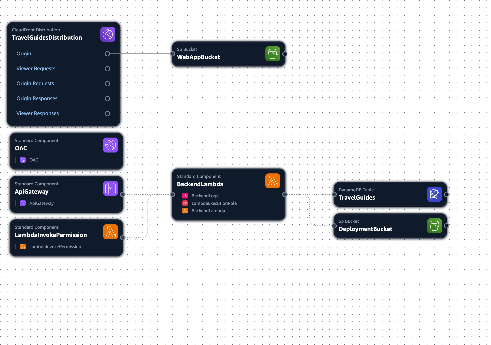

# Cloud Migration

## Architecture

- For each route a separate Lambda Function can be used, however for simplicity we will use a single Lambda Function that runs the backend.
- We use Provisioned Capacity for DynamoDB because this part of the [AWS Free Tier (Always Free)](https://aws.amazon.com/free/?all-free-tier.sort-by=item.additionalFields.SortRank&all-free-tier.sort-order=asc&awsf.Free%20Tier%20Types=tier%23always-free&awsf.Free%20Tier%20Categories=*all)
- AWS Resources are defined and managed using Infrastructre as Code (AWS CloudFormation)

>[!CAUTION]
> In a real production environment DynamoDB Capacity should be scaled automatically, either via AWS AutoScaling or by using DynamoDB On-Demand Capacity.  
> For this project provisioned capacity (25RCUs and 25WCUs) is used because this is part of AWS Free Tier

>[!CAUTION]
> In a real production environment Backup & Recovery needs to be considered. 
> PITR and AWS Backup are not used for this Proof of Concept Deployment. 

>[!TIP]
> Use of AWS Free Tier:
> - DynamoDB: 25GB Storage, 25RCUs, 25WCUs
> - Lambda: 1 Mio. Invocations and 400.000 GB-seconds compute time
> - CloudFront: 1TB Traffic and 10.000.0000 Requests
> - CloudWatch: 5GB of Logs Ingestion
> - X-Ray: 100.000 Traces

## Requirements

[Cloud Migration GitHub Milestone](https://github.com/marcelfrey29/IU-DOCC-Project-Cloud-Computing/milestone/2)

Tasks:

- #72
- #73
- #74
- #75

## Implementation

- General Setup (AWS Account was ready, AWS CLI)
- Start with simple CloudFormation Template and play around with it (add, change, and delete resources)
    - Start with Issue #73 (Single Resource)
    - Lean how it works and behaves, get experience
    - Read my notes from AWS Certifications and explore documentation (Service Documentations were really helpful)
    - Initial creation of stack
    - Stack updates
- Add scripts to make things repeatable with ease
    - Initial create, stack update, (and later delete etc.)
    - All required options are predefined (and documented in code)
- Add CloudFormation Linter
    - Locally and in CI
    - Very helpful, prevents failues of stack updates because access to invalid fields is reported before I applied the changes
        - E.g. Linter tells me that there is no field `ARN` but only `[Arn, Name, ...]`
- Update of the Web App
    - Create S3 and CloudFront Resources
        - SPA Error Handler to support client-side routing
    - Full URL was in every method (that was stupid...)
        - Add a global variable `apiBaseUrl`
        - Use an environment variable to set the URL during build (new build scripts for local and cloud variant)
    - Sync `dist` directory to S3 Bucket (Script to build and upload to S3)
- Backend: Refactor to Serverless 
    - Refactor to run in Lambda with [AWS Lambda Go](https://github.com/aws/aws-lambda-go/tree/main) (Libs and tools to write Lambda Functions in Go) and [AWS Lambda Go API Proxy](https://github.com/awslabs/aws-lambda-go-api-proxy) (Run common Go Web Frameworks like Fiber with AWS Lambda and API Gateway)
        - Minimal code changes required
        - Local execution no longer possible at the moment
    - Add deployment infrastructure for Lambda (S3 Bucket where the Code is stored), build, and upload the function code
    - CloudFormation for the Backend (Lambda Function, IAM Roles & Policies, CloudWatch Logs)
        - CloudFormation can't deploy IAM by default, requires flag (Good because IAM management is critical for security, but in AWS nothing works without IAM... )
    - If new code is uploaded to S3, it is not deployed to the Lambda Function automatically
        - Explicit code update in Lambda required (manual at first, but now automated via script)
    - Add API Gateway (as Proxy) and integrate it with CloudFront
        - CloudFront routes all traffic with the pattern `/api/*` to the API, so I needed to update the backend that all URLs start with `/api/`
        - Lambda Code update required
- Add script for cleanup of all AWS Ressources 
    - Empty buckets and delete Stack

## Implementation Notes

- Implementation is not "Serverless-Native"
- Single Function that runs a full web-framework instead of many small Lambda Functions
    - Overhead due to the web-framework (increases cold-start times)
    - But we still benefit from all scaling and availability advantages
- API Gateway as Proxy
    - All requests to the API are forwarded to the Lambda
    - No use of 404-handling, validation, etc.
- No AutoScaling for DynamoDB (_intended as described ealier_)
- No Backup/Recovery for DynamoDB (_intended as described ealier_)

## AWS Application Composer

- Visualize CloudFormation Templates and edit them via drag-and-drop and UI-Editor (No YAML)
    - Used only for visualization
    - CFN was written in YAML
- Not every connection between services is shown (e.g. CloudFront -> API Gateway)
- Tooling is visualized (e.g. Lambda <- S3 Deployment Bucket)

## Learnings / Notes

### CloudFormation

- Automatic rollback to previous state on update-failure is great!
    - Terraform CLI (`terraform apply`) doesn't do that
- CloudFormation can be visualized with Application Composer
    - The Terraform State can be visualized, but this is not very helpful
- CloudFormation has more direct connections between resources
    - Direct Reference from A to B: `A -> B`
    - Terraform often has an intermedie Resource (e.g. some kind of `Attachment` that connects A and B): `A <- Attachment -> B`
- CloudFormation doesn't give up... and tries things for quite a long time
    - Terraform fails faster which speeds up the feedback-loop (Personal experience, not measured)
    - Terraform has options to don't wait (e.g. when CloudFront Distributions are deployed which can take some time)
- CloudFormation adds random identifiers to all resource-names
    - Name-conflicts are very unlikely, but you can't rely on names (e.g. find by name)
- Sometimes the error messages are helpful, sometimes not - just like with Terraform

### Application

- UX can be improved
    - Currently there are no loading indicators (pages, buttons)
        - While latency was belog 1s at all time (cloud version), cold starts are noticeable 
        - 
    - The "Travel Guide is Private" screen is shown until the data are loaded...
