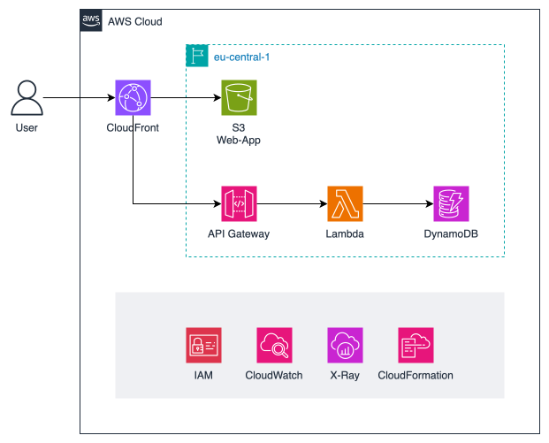

# Cloud Migration

## Architecture

- For each route a separate Lambda Function can be used, however for simplicity we will use a single Lambda Function that runs the backend.
- We use Provisioned Capacity for DynamoDB because this part of the [AWS Free Tier (Always Free)](https://aws.amazon.com/free/?all-free-tier.sort-by=item.additionalFields.SortRank&all-free-tier.sort-order=asc&awsf.Free%20Tier%20Types=tier%23always-free&awsf.Free%20Tier%20Categories=*all)
- AWS Resources are defined and managed using Infrastructre as Code (AWS CloudFormation)

>[!CAUTION]
> In a real production environment DynamoDB Capacity should be scaled automatically, either via AWS AutoScaling or by using DynamoDB On-Demand Capacity.  
> For this project provisioned capacity (25RCUs and 25WCUs) is used because this is part of AWS Free Tier

>[!CAUTION]
> In a real production environment Backup & Recovery needs to be considered. 
> PITR and AWS Backup are not used for this Proof of Concept Deployment. 

>[!TIP]
> Use of AWS Free Tier:
> - DynamoDB: 25GB Storage, 25RCUs, 25WCUs
> - Lambda: 1 Mio. Invocations and 400.000 GB-seconds compute time
> - CloudFront: 1TB Traffic and 10.000.0000 Requests
> - CloudWatch: 5GB of Logs Ingestion
> - X-Ray: 100.000 Traces

## Requirements

[Cloud Migration GitHub Milestone](https://github.com/marcelfrey29/IU-DOCC-Project-Cloud-Computing/milestone/2)

Tasks:

- #72
- #73
- #74
- #75

## Implementation

- TODO
